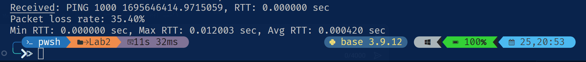
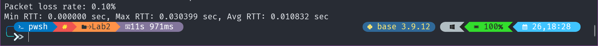
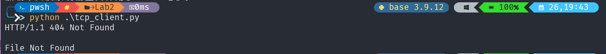
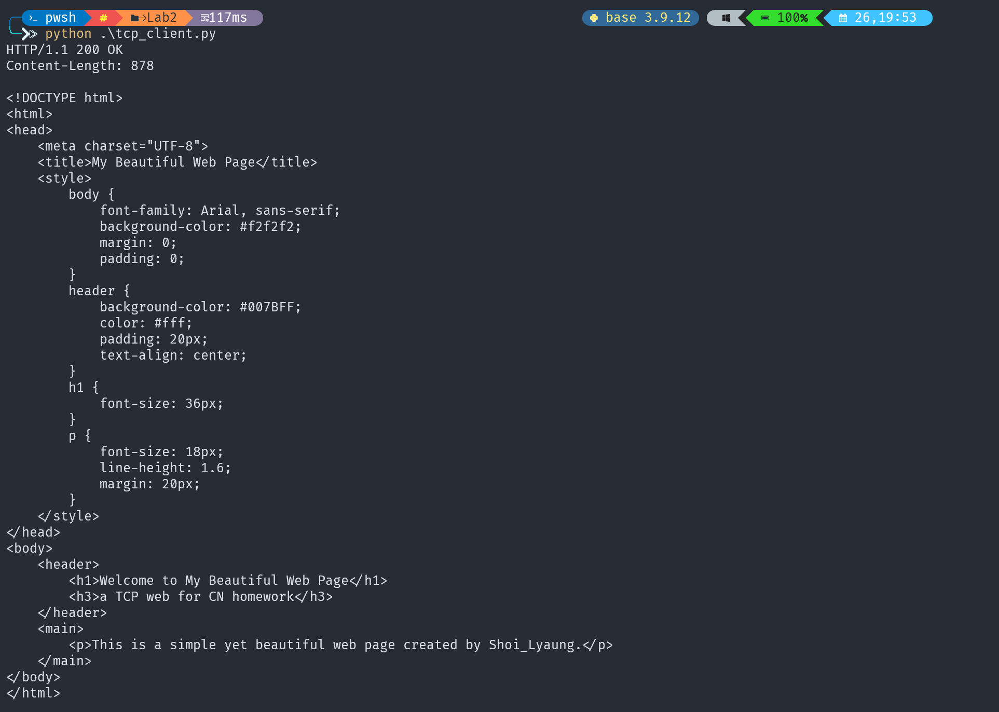

# 系统概述：

- 运行环境：Python 3.x

- 编译：无需编译，直接运行

- 使用方法：
  1. 在命令行中输入 `python udp_server.py`（ 或`python tcp_server.py`），启动服务器
  2. 在命令行中输入 `python udp_client.py`（ 或`python tcp_client.py`），启动客户端
  3. 观察命令行中的输出，它将显示每个 ping 报文的 RTT 和丢包率（或http报文）
  
- 实现环境：任何支持 Python 的环境，如 Windows、Linux、macOS 等

# 主要数据结构：

  - 套接字（socket）：用于网络通信的对象
  - 字符串（string）：用于存储和发送消息

# 主要算法描述：
  - 往返时间计算公式（RTT）$$rtt = Time_{end} - Time_{start}$$
  - 丢包率计算公式$$lossRate = \frac{Pings_{sent} - Pings_{received}}{Pings_{sent}} \times 100\%$$

---

---

# 运行结果

## UDP

### 本地

### 服务器

## TCP

### 客户端请求结果

1. 请求文件不存在

1. 请求文件存在

### 浏览器访问结果

> 将服务端放在远程主机上运行结果相同，但需注意远程主机需开放防火墙8080端口
