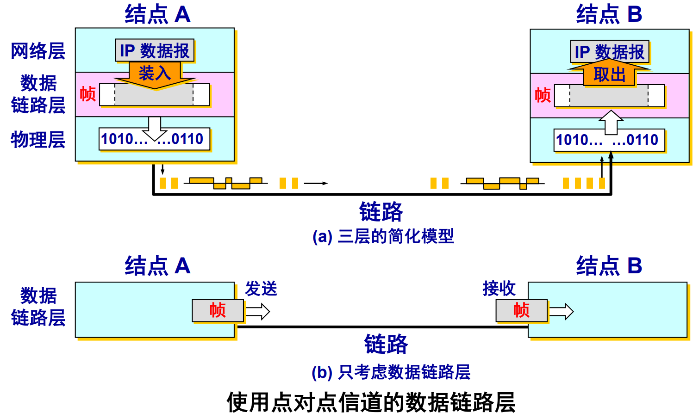
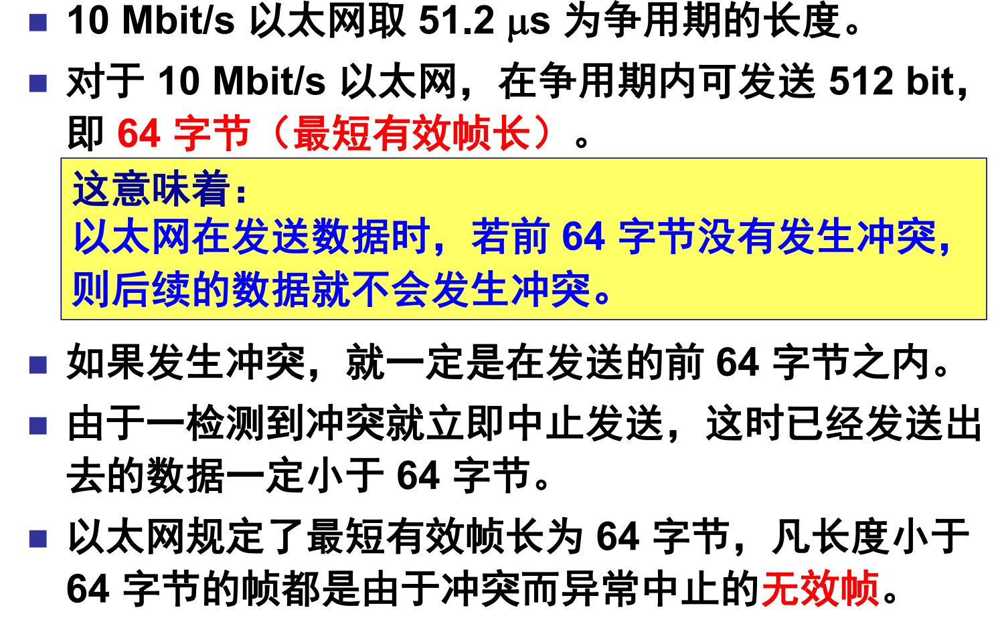

- 只考虑数据在数据链路层的流动
- 采用简化的链路层模型

## 3.1 使用点对点信道的数据链路层
### 3.1.1 数据链路和帧

- **链路 (link)** 是一条无源的结点到相邻结点的物理线路（有线或无线），中间没有任何其他的交换结点。 ^1f4a4e
	- 一条链路只是一条通路的一个组成部分。
- **数据链路 (data link)** 除了物理线路外，还必须有通信协议来控制这些数据的传输。若把实现这些协议的硬件和软件加到链路上，就构成了数据链路。 ^51052c
- 现在最常用的方法是使用**网络适配器**（即网卡）来实现这些协议的硬件和软件。
- 一般的适配器都包括了数据链路层和物理层这两层的功能。
- 也有人采用另外的术语。这就是把链路分为[[#^1f4a4e|物理链路]]和[[#^51052c|逻辑链路]]。
- 逻辑链路是物理链路加上必要的通信协议。
- 早期的数据通信协议曾叫做通信规程 (procedure)。因此在数据链路层，规程和协议是同义语
- **帧**

### 3.1.2 三个基本问题
1. [[#封装成帧]]：数据的传送以帧为单位帧定界
2. [[#透明传输]]：若所传的数据的比特片段与某一个控制信息相同，要有可靠机制，保证收方能正确识别
3. [[#差错控制]]：纠错：通过编码技术，接收方自动将差错改正过来检错：检测出帧有错误，要么忽略或重传

#### 封装成帧
- 接收方必须能从物理层接收的比特流中明确区分出一帧的开始和结束，这个问题被称为**帧同步**或**帧定界**
- 成帧（framing）的方式
	- [[#字节计数法]]（ Byte count ）
	- 带字节填充的定界符法（ Flag bytes with byte stuffing ）
	- 带比特填充的定界符法（ Flag bits with bit stuffing ）
	- 物理层编码违例（ Physical layer coding violations ）

#### 透明传输
##### 字节计数法

##### 字符填充法
- 帧定界符：当数据是由可打印的ASCII码组成的文本文件时，帧定界可以使用特殊的ASCII码（不可打印的控制字符）作为帧定界符。
- 控制字符 SOH (Start Of Header) 放在一帧的最前面，表示帧的首部开始 。 另一个控制字符 EOT (End Of Transmission) 表示帧的结束。

> 问题：如果有效载荷部分包含与“定界符”相同的字节会有什么问题？

##### 字节填充法
- 发送端的数据链路层在数据中出现控制字符“SOH”或“EOT”的前面插入一个转义字符“ESC” (其十六进制编码是1B)。

##### 比特填充法
- 使用一个特殊的比特模式01111110作为帧的起始和结束标志。（两个0比特之间，连续6个1比特，即0x7E ）
- 发送方边发送边检查数据，每连续发送5个“1”后在后面自动插入一个“0”。这样数据中只会连续出现5个 “1”，而不会出现定界符。
- 接收方在收到5个连续的“1”后将后面的“0”删掉而恢复出原始数据。

- 数据传输的基本单位是比特而不是字符，可用来传输任意长度的二进制比特串，通用性强。

##### 违例编码

#### 差错控制
- 比特差错
- 在一段时间内，传输错误的比特占所传输比特总数的比率称为误码率 BER (Bit Error Rate)
- 实际情况中，信噪比不可能为零

- 通常采用增加冗余信息（或称校验信息）的策略

##### 差错编码技术
- 检错码（奇偶校验码、CRC）

###### 1) 奇偶校验码
- 奇校验：使码字中“1”的总个数为奇数。
- 偶校验：使码字中“1”的总个数为偶数。
- 如果发生偶数个误码，则无法检测（漏检）

###### 2) 循环冗余校验
- 循环冗余码（Cyclic Redundancy Check，CRC）
- 将余数 R 作为冗余码（帧检验序列FCS (Frame Check Sequence)）拼接在数据 M 后面发送出去。

> 接收方
> 1. 生成多项式最高次数个0->构造被除数。
> 2. 生产多项式系数->构造除数。
> 3. 模 2 除法（取余数）。
> 4. 验证余数为0，正确；非0，错误。

- 发送端帧检验序列FCS的生成和接收端CRC检验都是 用硬件完成的，处理速度很快，不会延误数据的传输

- ~~P(X)--------生成多项式~~
- ~~M(X)--------信息多项式~~
- ~~R(X)--------冗余多项式~~
- ~~T(X)--------传输帧多项式~~

- 仅用循环冗余检验 CRC 差错检测技术只能做到**无差错接受 (accept)**。
	- “无差错接受”是指：“凡是**接受的帧（即不包括丢弃的帧）**，我们都能以非常接近于 1 的概率认为这些帧在传输过程中没有产生差错” 。

> [#1]-[#2]-[#3]
> - 传输差错 
> 	- 帧丢失 [#1]-[#3]
> 	- 帧重复 [#1]-[#2]-[#2]-[#3]
> 	- 帧失序 [#1]-[#3]-[#2]
> - 可靠传输
> 	- 帧编号
> 	- 确认：收到正确帧要发送确认
> 	- 重传机制：一定期限内，发送端未收到确认，则重传

- 在数据链路层使用 CRC 检验，能够实现无比特差错的传输，**但这还不是可靠传输**。
- 本章介绍的数据链路层协议都不是可靠传输的协议

###### 3) 纠错码----海明码（Hamming code）
- 在 k 比特信息 上附加 r 比特冗余信息（校验比特），构成 n=k+r 比特的码字，其中 每个校验比特 和 某几个特定的信息比特构成偶校验关系。
- **码距（海明距离Hamming Distance）**：一个编码系统中**任意两个合法编码（码字）之间不同的二进位（bit）数**叫这两个码字的码距。
	- 如果要检测出d个比特的错，则编码集的海明距离至少为d+1。
	- 如果要纠正 d个比特的错，则编码集的海明距离至少应为2d+1。
- 发送方冗余位计算$$k+r+1\le 2^{r}$$
- 校验位$R_{i}$放在海明码位号$2^{i-1}$的位置上
- 纠错：接收端利用相应的偶关系进行验证$$S=R_{1}\oplus I_{1} \oplus I_{2} \oplus I_{3} $$

### 3.2.1 点对点协议 / PPP (Point-to-Point Protocol)
- 封装 (Encapsulation)
	- PPP既支持异步链路（无奇偶检验的8比特数据），也支持面向比特的同步链路
	- IP数据包在PPP帧中是其信息部分，其长度受到MTU的限制
- 链路控制协议 LCP (Link Control Protocol)
- 网络控制协议 NCP (Network Control Protocol)

- 异步传输时：字符填充
	- 将信息字段中出现的每一个 0x7E 字节转变成为2字节序列 (0x7D, 0x5E)。
	- 若信息字段中出现一个 0x7D 的字节, 则将其转变成为2字节序列 (0x7D, 0x5D)。
- 同步传输时：比特填充
	- 在5个连续 1 的后面插入0

## 3.3 使用广播信道的数据链路层
### 3.3.1 局域网的数据链路层
- 局域网具有如下主要优点：
	- 具有广播功能，从一个站点可很方便地访问全网。局域网上的主机可共享连接在局域网上的各种硬件和软件资源。
	- 便于系统的扩展和逐渐地演变，各设备的位置可灵活调整和改变。
	- 提高了系统的可靠性、可用性和生存性。
- 用户使用的信道称为媒体（介质），决定由谁来使用信道的协议为“**媒体（介质）访问控制协议**”。

- 动态接入控制类型
	- 随机接入
		- 又称争用，用户发送前不需要取得发送权，有数据就发送， 发生冲突（碰撞）后采取措施解决冲突
	- ~~控制接入~~
		- ~~用户首先获得发送权，再发送数据，不会产生冲突~~
		- ~~令牌环局域网的多点线路探询（polling）~~

- 争用协议
	- ALOHA协议
	- CSMA/CD协议
	- 争用协议的特性
		- 随机访问：意味着对任何站都无法预计其 发送的时刻；
		- 竞争发送：是指所有发送的站自由竞争信 道的使用权。

#### ALOHA协议
- 纯ALOHA协议的思想==想发就发==
	- 任何用户有数据发送就可以发送（会带来冲突）
	- 如果发生冲突，接收方会检测出差错，然后不予确认，发送方一定时间内收不到确认就判断发生冲突；
	- 发现数据传输失败后，各自等待一段随机时间，再重新发送。
- 时隙ALOHA系统（Slotted ALOHA）：把时间分为若干个相同的时间片，所有用户在时间片开始时刻同步接入网络信道，若发生冲突，则必须等到下一个时间片开始时刻再发送。

#### CSMA/CD 协议
==先听后发，边听边发，冲突停止，延迟重发==
- CSMA/CD 含义：载波监听 多点接入 / 碰撞检测 (Carrier Sense Multiple Access with Collision Detection) 。
- “碰撞检测”就是计算机边发送数据边检测信道上的信号电压大小。
- 使用 CSMA/CD 协议的以太网不能进行全双工通信而只能进行双向交替通信（半双工通信）。
- 每个站在发送数据之后的一小段时间内，存在着遭遇碰撞的可能性。
- 这种发送的不确定性使整个以太网的平均通信量远小于以太网的最高数据率。

- 两个重要问题
	- [[#争用期]]
	- [[#退避算法]]

##### 争用期
- 最先发送数据帧的站，在发送数据帧后至多经过时间 $2\tau$（两倍的端到端往返时延）就可知道发送的数据帧是否遭受了碰撞。
- 以太网的端到端往返时延 $2\tau$ 称为争用期，或碰撞窗口。

##### 退避算法
二进制指数类型退避算法 (truncated binary exponential type)
- 发生碰撞的站在停止发送数据后，要推迟（退避）一 个随机时间才能再发送数据。
- 基本退避时间取为争用期 $2\tau$。
- 从整数集合$[0, 1, 2，3，4，… , (2^k −1)]$中随机地取出一个 数，记为$r$。重传所需的时延就是 $r$ 倍的基本退避时间。
- $k = Min[重传次数, 10]$
- 当 $k\le10$ 时，参数 k 等于重传次数。
- 当重传达 16 次仍不能成功时即丢弃该帧，并向高层报告。

###### 最短帧长
$发送时延 = \frac{数据帧长度（bit）}{数据传输速率（bit/s）} >= 2τ$
- $最短帧长= 2\tau x 数据传输速率$

##### 强化碰撞
- 当发送数据的站一旦发现发生了碰撞时：
	1.  立即停止发送数据
	2. 再继续发送若干比特的人为干扰信号 (jamming signal)，以便让所有用户都知道现在 已经发生了碰撞。

## 3.4 以太网
### 以太网（Ethernet）的两个标准
- DIX Ethernet V2 是DEC、Intel、Xerox公司联合提出的世界上第一个局域网产品（以太网）的规约 ——10M/s的以太网规约。
- IEEE 802.3 是第一个 IEEE 802委员会制定的局域网标准
- 逻辑链路控制 LLC (Logical Link Control)子层
- 媒体接入控制 MAC (Medium Access Control)子层
- 1990 年，IEEE 制定出星形以太网 10BASE-T 的标准 802.3i。

### 集线器的特点
- 使用集线器的以太网在逻辑上仍是一个总线网，各工作站使用的还是 CSMA/CD 协议，并共享逻辑上的总线。

### 以太网信道被占用的情况
- 在以太网中定义了参数 α，它是以太网单程端到端时延 $\tau$ 与帧的发送时间 $T_0$ 之比： $\alpha =\tau/T_0$
	- α →0，表示一发生碰撞就立即可以检测出来， 并立即停止发送，因而信道利用率很高。 
	- α 越大，表明争用期所占的比例增大，每发生一次碰撞就浪费许多信道资源，使得信道利用率明显降低。
- 发送一帧占用线路的时间是 $T_0 + \tau$，而帧本身的发送时间是 $T_0$。于是我们可计算出理想情况下的极限信道利用率 $S_{max}$ 为：$$S_{max}=\frac{T_{0}}{T_0+\tau}=\frac{1}{1+a}$$
	- 只有当参数 a 远小于 1 才能得到尽可能高的极限信道利用率。
### 3.4.3 以太网的MAC层
- 网络接口板又称为适配器 (adapter) 或网络接口卡 NIC (Network Interface Card)，或“网卡”
- 适配器的重要功能：
	- 进行串行/并行转换。
	- 对数据进行缓存。
	- 在计算机的操作系统安装设备驱动程序。
	- 实现以太网协议。
- IEEE 的注册管理机构 RA 负责向生产局域网网卡的厂家分配地址字段 6 个字节中的前三个字节 (即高位 24 位)，称为组织唯一标识符OUI。
- 地址字段 6 个字节中的后三个字节 (即低位 24 位) 由厂家自行指派，称为扩展唯一标识符EUI，必须保证生产出的适配器没有重复地址。
- IEEE 规定地址字段的第一字节的最低位为 I/G 位。I/G 表示 Individual / Group。
	- 当 I/G位 = 0 时，地址字段表示一个单站地址。
	- 当 I/G位 = 1 时，表示组地址，用来进行多播（以前曾译为组播）。此时，IEEE 只分配地址字段前三个字节中的 23 位。
- IEEE 把地址字段第一字节的最低第 2 位规定为 G/L 位，表示 Global / Local。
	- 当 G/L位 = 0 时，是全球管理（保证在全球没有相同的地址），厂商向IEEE购买的 OUI 都属于全球管理。
	- 当 G/L位 = 1 时， 是本地管理，这时用户可任意分配网络上的地址。

#### 以太网 V2 的 MAC 帧格式
- 无效的 MAC 帧数据字段的长度不在 46 ~ 1500 字节之间。
- 有效的 MAC 帧长度为 64 ~ 1518 字节之间。

### 集线器
- 物理层

### 网桥
- 数据链路层

### 网桥和集线器的不同
- 集线器在转发帧时，不对传输媒体进行检测。
- 网桥在转发帧之前必须执行 CSMA/CD 算法。
	- 若在发送过程中出现碰撞，就必须停止发送和进行退避。
	- 在这一点上网桥的接口很像一个网卡。但网桥却没有网卡。
- 由于网桥没有网卡，因此网桥并不改变它转发的帧的源地址。

### 交换机
- 工作在全双工方式
- 并行性
- 接口有存储器
- **自学习算法**
- 高速背板
#### 交换模式
1. 存储转发模式（Store and Forward）
2. 直通模式（Cut-through）
3. 无碎片模式（Fragment-free）

#### 自学习算法
- MAC地址表的构建
	- 增加表项：帧的源地址对应的项不在表中
	- 删除表项：老化时间到期
	- 更新表项：帧的源地址在表中，更新时间戳
- 转发帧的过程
	- Forwarding（转发）
	- Filtering（过滤）
	- Flooding（泛洪）

#### 物理环路引发的问题：广播风暴
- 生成树协议
	1. 选举根桥(Root Bridge) 。
	2. 为每个非根桥选出一个根端口（Root Port）。
	3. 为每个网段确定一个指定端口（Designated Port）。

