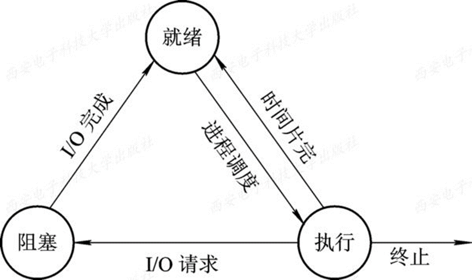

- PCB **进程控制块**（Process Control Block）
- entity
- object
- exclusive
- time slice 分配
- cpu
	- instruction stream
	- 线程
	- 超线程 super thread

## 2.2 进程的描述
### 2.2.2  进程的基本状态及转换
1. 就绪(Ready)状态
2. 执行(Running)状态
3. 阻塞(Block)状态

- fork()
- wait



- ~~终止状态~~ ZOMB状态（僵尸态）

## 2.3 进程控制
- 原子操作

## 2.4 进程同步
**同步的原理是通过存储器的读写**
1. 穿过cache
2. 读写的原子性（体现在总线上：lock）

### 2.4.1 进程同步的基本概念
2. 临界资源(Critical Resouce)
3. 临界区(critical section)
	- 不论是硬件临界资源还是软件临界资源，多个进程必须互斥地对它进行访问。人们把在每个进程中访问临界资源的那段代码称为 **临界区(critical section)** 。
	- 对多个进程的临界区，设定一个信号量mutex。mutex这个信号量，**初值为1**。mutex是常用于解决互斥问题的时候所定义的一个信号量变量。是**互斥（mutual exclusion）**的缩写。

### 2.4.2 硬件同步机制
1. 关中断(disable interuption)
2. 利用TS(Test-and-Set)指令 实现互斥测试并建立
3. 利用Swap指令实现进程互斥

### 2.4.3 信号量机制(Semaphore)
1. 整型信号量
	- 最初由Dijkstra把整型信号量定义为一个用于表示资源数目的整型量S，它与一般整型量不同，除初始化外，仅能通过两个标准的原子操作(Atomic Operation) **wait(S)** 和**signal(S)** 来访问。很长时间以来，这两个操作一直被分别称为**P、V操作**。
	- P、V分别是荷兰语的**尝试test(Proberen)** 和**增加increment(Verhogen)**
1. 记录型信号量
	- 让权等待
2. AND型信号量
3. 信号量集

### 2.4.5 管程机制(Monitor)
- 并发 Pascal语言

### 现在常用的并发机制
- C++、Java都提供：
	1. synchronized
	2. volatile

## 2.5 经典进程的同步问题
### 2.5.1 生产者-消费者问题(The producer-consumer problem)
> 缓冲管理

**生产者：**

```c
producer() {
	while(1) {
		生产一个产品;
		P(empty);
		P(mutex);
		把产品放入缓冲区;
		V(mutex);
		V(full);
	}
}
```

**消费者：**

```c
consumer() {
	while(1) {
		P(full);
		P(mutex);
		从缓冲区取出一个产品;
		V(mutex);
		V(empty);
		使用产品;
	}
}
```

### 2.5.2 哲学家进餐问题(The DIning Philosophers Problem)
> 一张圆桌上坐着5名哲学家，每两个哲学家之间的桌上摆一根筷子，桌子的中间是一碗米饭。哲学家们倾注毕生的精力用于思考和进餐，哲学家在思考时，并不影响他人。只有当哲学家饥饿时，才试图拿起左、右两根筷子（一根一根地拿起）。如果筷子已在他人手上，则需等待。饥饿的哲学家只有同时拿起两根筷子才可以开始进餐，当进餐完毕后，放下筷子继续思考。

```c
semaphore chopstick[5] = {1,1,1,1,1};
Pi(){
	while(1){
		P(chopstick[i]);       // 拿起左边筷子
		P(chopstick[(i+1)%5]); // 拿起右边筷子
		吃饭;
		V(chopstick[i]);       // 放下左边筷子
		V(chopsticl[(i+1)%5]); // 放下右边筷子
		思考;
	}
}
```

如果5个哲学家同时拿起左边筷子，则会发生“**死锁**”。

**解决方案：**

1. 最多允许四个哲学家同时进餐。
2. 奇数号哲学家先拿左边的筷子，再拿右边的筷子，偶数号哲学家相反。
3. 仅当一个哲学家左右两根筷子都可以使用时，才可以拿起筷子。

```c
semaphore chopstick[5] = {1,1,1,1,1};
semaphore mutex = 1;             // 互斥地拿筷子
Pi(){
	while(1){
		P(mutex);
        P(chopstick[i]);         // 拿起左边筷子
		P(chopstick[(i+1)%5]);   // 拿起右边筷子
        V(mutex);
		吃饭;
		V(chopstick[i]);         // 放下左边筷子
		V(chopsticl[(i+1)%5]);   // 放下右边筷子
		思考;
	}
}
```

### 2.5.3 读者-写者问题(Reader-Writer Problem)
- 有读者和写者两组并发进程，共享一个文件，当两个或两个以上的读进程同时访问共享数据时不会产生副作用，但若某个写进程和其他进程（读进程或写进程）同时访问共享数据时则可能导致数据不一致的错误。因此要求：
	1. **允许多个读者**可以同时对文件执行读操作；
	2. **只允许一个写者**往文件中写信息；
	3. **读写不能同时进行。** 写者执行写操作前，应让已有的读者和写者全部退出。任一写者在完成写操作之前不允许其他读者或写者工作；
		- [[#猴子过桥问题]]

**信号量：**

```c
semaphore rw = 1;    // 实现对文件的互斥访问
int count = 0;       // 当前访问文件的读进程数
semaphore mutex = 1; // 保证对count变量的互斥访问
semaphore w = 1;     // 用于实现“写优先”
```

**写者&读者：**

```c
writer(){
	while(1){
		P(w);
		P(rw);
		写文件;
		V(rw);
		V(w);
	}
}

reader(){
	while(1){
		P(w);
		P(mutex);
		if(count == 0)
			P(rw);
		count++;
		V(mutex);
		V(w);
		读文件;
		P(mutex);
		count--;
		if(count == 0)
			V(rw);
		V(mutex);
	}
}
```

### 猴子过桥问题


### 理发师问题

## 2.6 进程通信
- IPC (Inter Process Communication)
- 分布计算、线程迁移
1. 共享存储器系统(Shared-Memory System)
2. 管道(pipe)通信系统
3. 消息传递系统(Message passing system)
4. 客户机-服务器系统(Client-Server system)
	- 套接字(socket)
		- 计算机网络
	- 远程过程调用
		- RPC (Remote Procedure Call)
	- 远程方法调用（面向对象的RPC）
		- common object orient
		- Braker Architecture

### 2.6.2　消息传递通信的实现方式
1. 直接消息传递系统
2. **信箱通信**

## 2.7 线程(Threads)
### 2.7.1 线程的引入

## 2.8 线程的实现
### 2.8.1 线程的实现方式
1. 内核支持线程KST(Kernel Supported Threads)
	- Unix 线程做不好——clone
2. 用户级线程的实现
